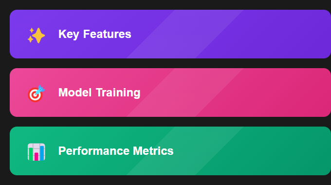

# 🎯 Claude Tune

<div align="center">


[](https://www.python.org/)
[](https://www.anthropic.com/)
[](https://pytorch.org/)
[](https://wandb.ai/)

[English](#english) | [Русский](#русский)

</div>

---

<a name="english"></a>
# 🇺🇸 English

<div align="center">

</div>

## 📋 About
Claude Tune is a powerful platform for fine-tuning Claude AI models. It provides tools for dataset preparation, model training, and performance evaluation, making it easier to create specialized AI models for specific tasks.

## ✨ Key Features
- 🎯 Advanced model fine-tuning
- 📊 Performance metrics tracking
- 🔄 Continuous training
- 📈 Learning rate optimization
- 🎚️ Hyperparameter tuning

<div align="center">

</div>

## 🛠️ Tech Stack
- 🐍 Python 3.9+
- 🤖 Claude AI API
- 🔥 PyTorch
- 📊 Weights & Biases
- 🔄 Hugging Face Transformers

## 🚀 Quick Start
```bash
# Clone repository
git clone https://github.com/Ivantech123/claudetuine.git
cd claudetuine

# Install dependencies
pip install -r requirements.txt

# Set up environment
cp .env.example .env
# Add your API keys to .env

# Start training
python train.py
```

---

<a name="русский"></a>
# 🇷🇺 Русский

## 📋 О проекте
Claude Tune - мощная платформа для тонкой настройки моделей Claude AI. Предоставляет инструменты для подготовки данных, обучения моделей и оценки производительности, упрощая создание специализированных AI моделей для конкретных задач.

<div align="center">

</div>

## ✨ Возможности
- 🎯 Продвинутая тонкая настройка моделей
- 📊 Отслеживание метрик производительности
- 🔄 Непрерывное обучение
- 📈 Оптимизация скорости обучения
- 🎚️ Настройка гиперпараметров

## 🛠️ Технологии
- 🐍 Python 3.9+
- 🤖 Claude AI API
- 🔥 PyTorch
- 📊 Weights & Biases
- 🔄 Hugging Face Transformers

## 🚀 Быстрый старт
```bash
# Клонировать репозиторий
git clone https://github.com/Ivantech123/claudetuine.git
cd claudetuine

# Установить зависимости
pip install -r requirements.txt

# Настроить окружение
cp .env.example .env
# Добавьте свои API ключи в .env

# Начать обучение
python train.py
```

## 📦 Структура проекта
```
src/
├── training/     # Обучение моделей
├── data/         # Подготовка данных
├── metrics/      # Метрики и оценка
├── models/       # Архитектуры моделей
└── utils/        # Утилиты
```

## 📫 Контакты
Email: abloko362@gmail.com

# Claude Fine-tuning Project

Проект для оптимизированного дообучения (fine-tuning) модели Claude от Anthropic с расширенной системой метрик и автоматической настройкой параметров.

## Содержание
- [Основные функции](#основные-функции)
- [Система метрик](#система-метрик)
- [Оптимизации](#оптимизации)
- [Использование](#использование)
- [Требования](#требования)
- [Мониторинг](#мониторинг)
- [Безопасность](#безопасность)
- [Рекомендации](#рекомендации)
- [Быстрый запуск](#быстрый-запуск)
- [RAG и веб-интерфейс](#rag-и-веб-интерфейс)

## Основные функции

- 🔄 Динамическая настройка параметров обучения
- 📊 Расширенная система метрик и оценки качества
- 💾 Умная система контрольных точек
- 🛑 Автоматическая ранняя остановка
- 📈 Детальное отслеживание прогресса

## Система метрик

### Основные метрики

#### 1. Перплексия (Perplexity)
- **Что измеряет**: Уверенность модели в предсказаниях
- **Как считается**: exp(-mean(log(probabilities)))
- **Интерпретация**: Меньше = лучше
- **Использование**: Основная метрика для оценки качества обучения

#### 2. Неопределенность (Uncertainty)
- **Что измеряет**: Степень неуверенности в ответах
- **Как считается**: -mean(log_probs)
- **Интерпретация**: Меньше = лучше
- **Использование**: Помогает выявить проблемные примеры

#### 3. Полнота ответа (Completeness)
- **Что измеряет**: Насколько полно ответ покрывает запрос
- **Как считается**: Пересечение ключевых слов запроса и ответа
- **Интерпретация**: 0.0-1.0, больше = лучше
- **Использование**: Оценка качества ответов

#### 4. Релевантность контексту (Context Relevance)
- **Что измеряет**: Соответствие ответа контексту
- **Как считается**: Семантическое сходство ответа и контекста
- **Интерпретация**: 0.0-1.0, больше = лучше
- **Использование**: Оценка понимания контекста

### Система оценки качества

#### Автоматическая оценка
```python
metrics = {
    'perplexity': model_evaluator.calculate_perplexity(response),
    'uncertainty': model_evaluator.calculate_uncertainty(response),
    'completeness': model_evaluator.evaluate_completeness(response, prompt),
    'context_relevance': model_evaluator.evaluate_context_relevance(response, context)
}
```

#### Ранняя остановка
- Отслеживание улучшения метрик
- Настраиваемый параметр patience (по умолчанию = 3)
- Минимальный порог улучшения (по умолчанию = 0.01)
- Автоматическая остановка при отсутствии прогресса

## Оптимизации

### Динамический размер батча
- **Большие датасеты** (≥1000 примеров)
  - Размер батча: 64
  - Причина: Лучшая стабильность на больших данных
  
- **Средние датасеты** (500-1000 примеров)
  - Размер батча: 32
  - Причина: Баланс между скоростью и стабильностью
  
- **Малые датасеты** (<500 примеров)
  - Размер батча: 16
  - Причина: Лучшая точность на малых данных

### Адаптивный Learning Rate
- **Большие датасеты**: 1.5
  - Быстрее сходимость на больших данных
  - Более агрессивное обучение
  
- **Средние датасеты**: 1.0
  - Стандартная скорость обучения
  - Хороший баланс
  
- **Малые датасеты**: 0.5
  - Осторожное обучение
  - Предотвращение переобучения

### Система контрольных точек
- Автоматическое сохранение каждые 5 батчей
- Сохранение всех метрик и параметров
- Возможность восстановления обучения
- Защита от потери данных

## Использование

### Подготовка данных
```python
# Пример структуры данных
training_data = [
    {
        "input": "Пользовательский запрос",
        "output": "Ожидаемый ответ модели"
    }
]
```

### Запуск обучения
```python
from finetune import ClaudeFineTuner

# Инициализация
tuner = ClaudeFineTuner()

# Загрузка и валидация данных
validated_data = tuner.prepare_training_data(json_data, xlsx_data)

# Запуск обучения
results = tuner.fine_tune(validated_data)

# Анализ результатов
metrics = tuner.evaluator.get_average_metrics()
```

## Мониторинг

### Логирование
- Подробное логирование всех этапов
- Отслеживание метрик в реальном времени
- Сохранение истории обучения

### Метрики производительности
- График изменения перплексии
- Динамика неопределенности
- Статистика полноты ответов
- Анализ релевантности

## Требования

- Python 3.8+
- Anthropic API ключ
- Зависимости из requirements.txt

## Безопасность

- Валидация входных данных
- Безопасное сохранение контрольных точек
- Обработка ошибок API
- Защита от потери данных

## Рекомендации

1. **Подготовка данных**
   - Тщательная валидация
   - Разнообразные примеры
   - Проверка качества

2. **Настройка параметров**
   - Начните с малого размера батча
   - Постепенно увеличивайте learning rate
   - Следите за метриками

3. **Мониторинг**
   - Регулярно проверяйте метрики
   - Анализируйте ошибки
   - Сохраняйте контрольные точки

4. **Оптимизация**
   - Используйте раннюю остановку
   - Экспериментируйте с параметрами
   - Документируйте результаты

## Быстрый запуск

### Windows
1. Просто дважды кликните на файл `run.bat`
2. Или запустите через командную строку:
```bash
.\run.bat
```

### Linux/Mac
1. Сделайте скрипт исполняемым:
```bash
chmod +x run.sh
```
2. Запустите скрипт:
```bash
./run.sh
```

### Веб-интерфейс
После запуска откроется веб-интерфейс со следующими возможностями:
- Загрузка обучающих данных (JSON/XLSX)
- Настройка параметров обучения
- Визуализация метрик в реальном времени
- Мониторинг процесса обучения
- Анализ результатов

## RAG и веб-интерфейс

### RAG

Многофункциональное приложение для работы с Claude AI, поддерживающее как fine-tuning, так и Retrieval-Augmented Generation (RAG).

#### Основные возможности

- Загрузка документов в базу знаний (поддерживаемые форматы: TXT, PDF, DOC, DOCX)
- Векторное индексирование с помощью Pinecone
- Гибкая система генерации эмбеддингов (Voyage AI или sentence-transformers)
- Контекстно-зависимые ответы на вопросы
- Управление базой знаний (добавление/удаление документов)

#### API Endpoints

- `POST /upload_documents`: Загрузка документов в базу знаний
- `POST /clear_kb`: Очистка базы знаний
- `POST /rag`: Выполнение RAG запроса

### Веб-интерфейс

#### Основные возможности

- Загрузка обучающих данных (JSON/XLSX)
- Настройка параметров обучения
- Визуализация метрик в реальном времени
- Мониторинг процесса обучения
- Анализ результатов

#### API Endpoints

- `POST /upload`: Загрузка тренировочных данных
- `POST /fine-tune`: Запуск fine-tuning процесса

# Claude Hybrid System: Fine-tuning + RAG

Гибридная система, объединяющая возможности Fine-tuning и Retrieval-Augmented Generation (RAG) для улучшенного взаимодействия с Claude.

## Содержание
- [Возможности](#возможности)
- [Быстрый старт](#быстрый-старт)
- [Компоненты системы](#компоненты-системы)
- [Особенности и ограничения](#особенности-и-ограничения)
- [Устранение проблем](#устранение-проблем)

## Возможности

### Fine-tuning
- 🎯 Дообучение модели на специфических данных
- 📊 Система метрик и оценки качества
- 💾 Сохранение и загрузка моделей
- 🔄 Динамическая настройка параметров

### RAG (Retrieval-Augmented Generation)
- 📚 Загрузка и индексация документов
- 🔍 Семантический поиск по базе знаний
- 📈 Ранжирование релевантных фрагментов
- 🔄 Обновление базы знаний в реальном времени

### Гибридный режим
- 🤝 Объединение Fine-tuning и RAG
- 🎛️ Гибкое управление компонентами
- 📝 Сохранение контекста диалога
- 📊 Отслеживание источников информации

## Быстрый старт

### Windows
```bash
.\run.bat
```

### macOS
```bash
chmod +x run_mac.sh  # Только при первом запуске
./run_mac.sh
```

### Linux
```bash
chmod +x run.sh  # Только при первом запуске
./run.sh
```

После запуска откройте браузер: `http://localhost:5000`

## Компоненты системы

### 1. Fine-tuning
- Загрузка тренировочных данных в формате JSONL
- Настройка параметров обучения
- Мониторинг процесса
- Оценка результатов

### 2. RAG
- Поддержка различных форматов документов:
  - Текстовые файлы (.txt)
  - PDF документы (.pdf)
  - Word файлы (.doc, .docx)
- Автоматическая индексация
- Семантический поиск
- Управление базой знаний

### 3. Веб-интерфейс
- Три режима работы:
  - Fine-tuning
  - RAG
  - Гибридный чат
- Интуитивное управление
- Отображение результатов
- История диалога

## Особенности и ограничения

### Загрузка файлов
- **Максимальный размер**: 10MB
- **Форматы**: .txt, .pdf, .doc, .docx
- **Ограничения**: 
  - PDF без пароля
  - Текстовые документы
  - Сканы с OCR

### База знаний
- **Индексация**: Автоматическая
- **Обновление**: В реальном времени
- **Ограничения**: Зависит от размера Pinecone индекса

### Fine-tuning
- **Формат данных**: JSONL
- **Структура**: prompt/completion пары
- **Время**: Зависит от объема данных

### Гибридный чат
- **Контекст**: Сохраняется в рамках сессии
- **Источники**: Отображаются под ответами
- **Компоненты**: Можно включать/выключать

## Устранение проблем

### Проблемы с загрузкой
1. **Файл не загружается**
   - Проверьте размер файла
   - Убедитесь в поддержке формата
   - Проверьте права доступа

2. **Ошибки индексации**
   - Проверьте формат документа
   - Убедитесь в наличии текстового слоя
   - Очистите базу и попробуйте снова

### Проблемы с ответами
1. **Медленные ответы**
   - Уменьшите размер базы знаний
   - Проверьте интернет-соединение
   - Используйте более конкретные запросы

2. **Некорректные ответы**
   - Проверьте качество документов
   - Убедитесь в релевантности базы знаний
   - Попробуйте переформулировать запрос

### Системные проблемы
1. **Сервер не запускается**
   - Проверьте наличие Python 3.8+
   - Установите все зависимости
   - Проверьте .env файл

2. **Ошибки API**
   - Проверьте API ключи
   - Убедитесь в доступности сервисов
   - Проверьте квоты и лимиты

## Требования

### Системные
- Python 3.8+
- 4GB RAM минимум
- Стабильное интернет-соединение

### API ключи
- Anthropic API key
- Pinecone API key
- Pinecone Environment

### Браузеры
- Chrome (рекомендуется)
- Firefox
- Safari (возможны проблемы с отображением)

## Рекомендации по использованию

### Оптимальная производительность
1. Регулярно очищайте базу знаний
2. Используйте качественные документы
3. Формулируйте четкие запросы

### Лучшие практики
1. Начинайте с тестовых запросов
2. Проверяйте источники информации
3. Используйте подходящий режим работы

### Безопасность
1. Не загружайте конфиденциальные данные
2. Регулярно обновляйте API ключи
3. Следите за доступом к системе

## Техническая поддержка

При возникновении проблем:
1. Проверьте логи в консоли
2. Убедитесь в актуальности зависимостей
3. Проверьте настройки в .env файле

## Обновления

Система активно развивается. Следите за обновлениями в репозитории.
